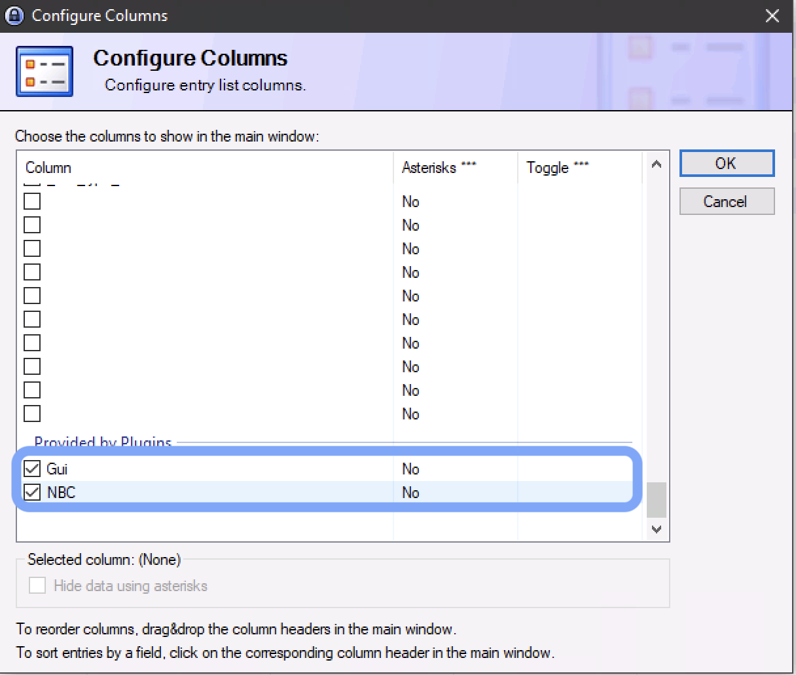
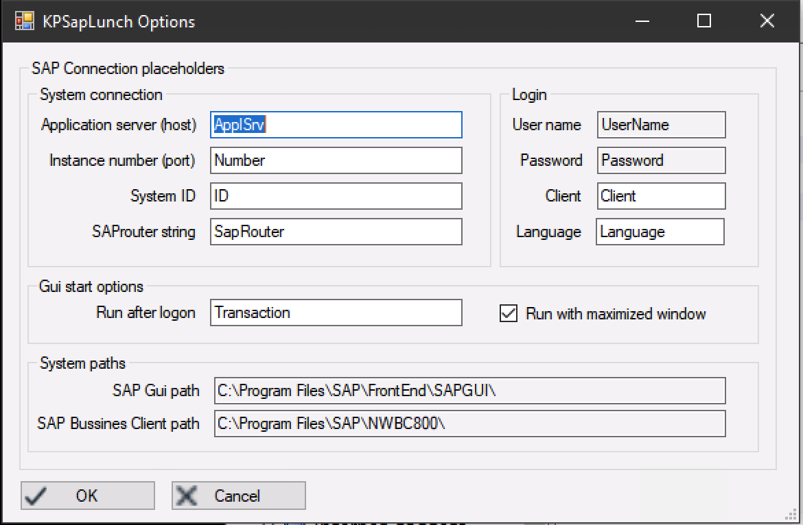
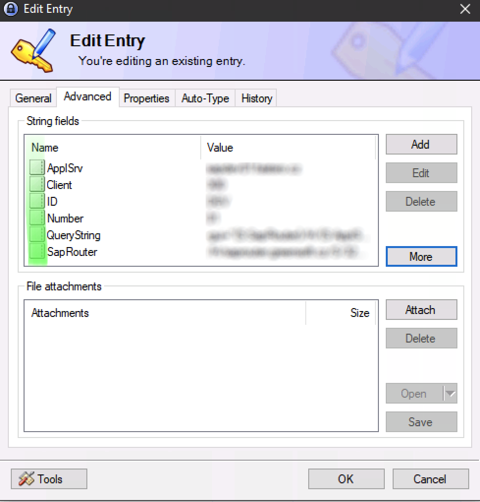
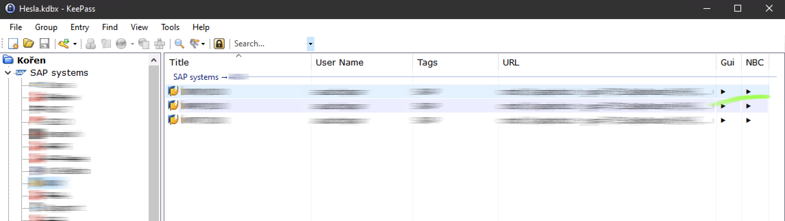

# KPSAPLunch
KeePass 2.x plugin integrates usage of SAPGui and NWBC

## Intro
>Plugin for original keePass 2.x application for easy integration with SAP clients (SAP GUI and Bussines Client).
>Using Entry attributes easily you can run SAPGui or NW Bussines client (if installed) by clicking new columns provided by this plugin.

## Install
> Simply copy plugin file into KeePass plugin directory.

## Usage
### New columns
> In layout setting you can add a new plugin columns to entries layout. These columns provide a lunch and login function one of the clients.
>

### Placeholders settings
> You can set (or leave default if not used yet) entry __string value__ name (located in entry advance properties) by plugin options. 
> 
>
> These string values should holds login values.
>

### Use it
> Plugin should detect an application binaries automaticaly (can be check on plugin option dialog).
> Just double click on new colum in entry row and voila.
>
